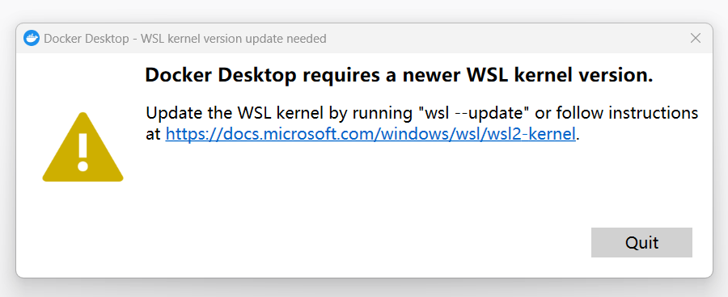
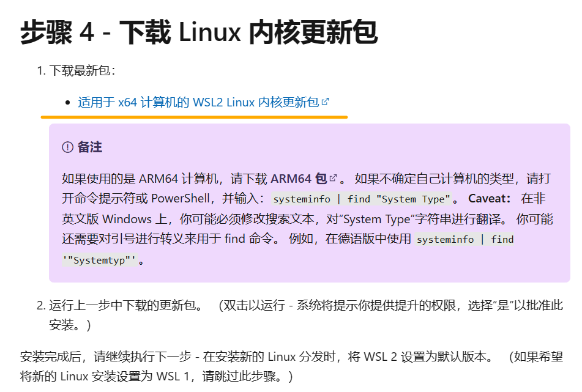
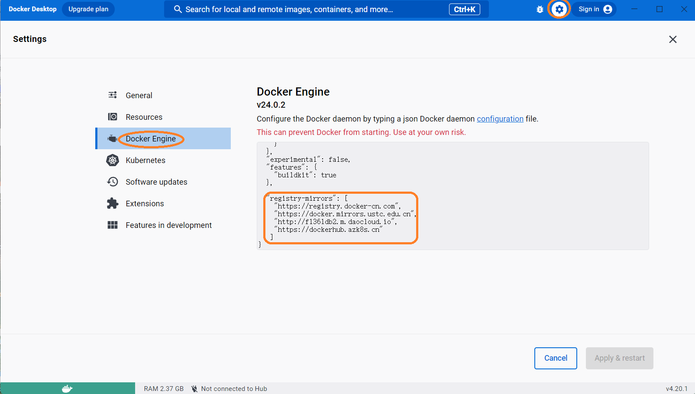

# 安装

## windows

到官网下载最新的安装包直接安装，启动时候如果报错



就点击显示的[链接](https://learn.microsoft.com/zh-cn/windows/wsl/install-manual#step-4---download-the-linux-kernel-update-package)跳转到微软官网下载更新包



我这里安装好更新包就能正常启动了。


## 国内下载源

### windows

需要设置国内下载源，不然下载镜像超级慢，点击`设置` -> `Docker Engine`，在配置项里面追加`registry-mirrors`字段。




注意：需要符合json格式

```json
{  
  "registry-mirrors": [
    "https://registry.docker-cn.com",
    "https://docker.mirrors.ustc.edu.cn",
    "http://f1361db2.m.daocloud.io",
    "https://dockerhub.azk8s.cn"
   ]
}
```
