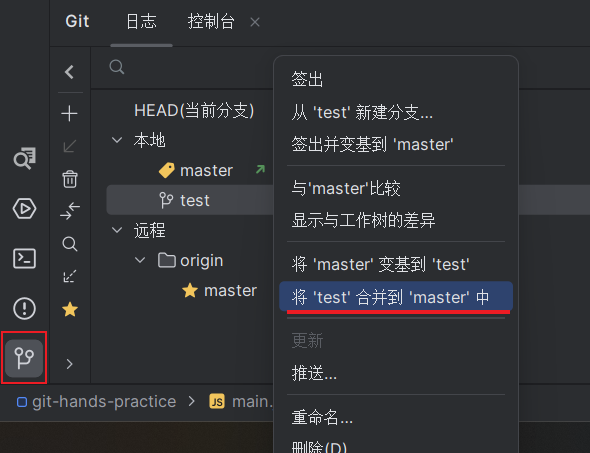
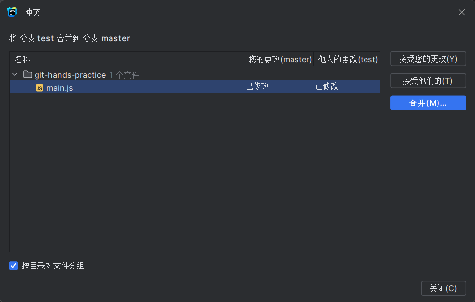
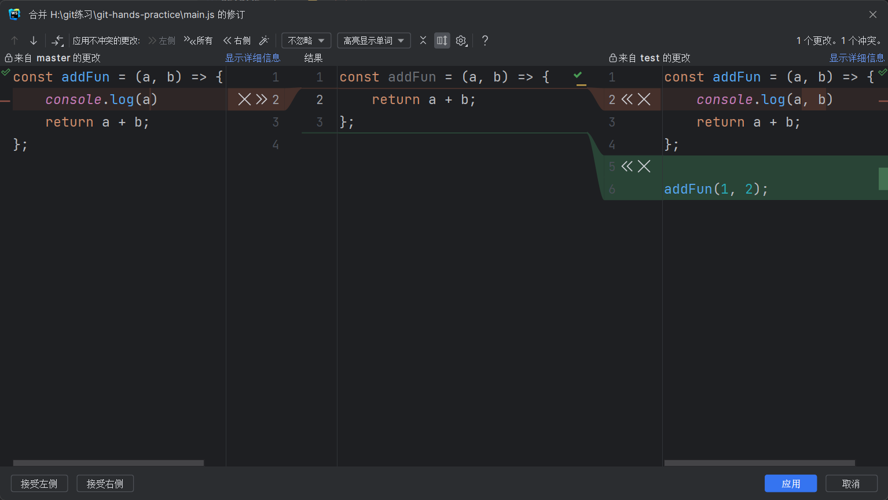

# 分支合并

```shell
# 把test分支的内容合并到当前分支
git merge test
```

## 推荐方法

因为合并的时候经常会遇到冲突，就是两个分支都修改了同一个文件，这时候就需要一个可视化的工具来查看冲突的代码，
推荐用`WebStore`自带的git工具来解决

先切换到要合并的分支，这里我要把`test`分支的内容合并到`master`，所以就要切换到`master`分支。然后点击合并test到master



如果文件有冲突会自动提示，这里提示`main.js`有冲突



双击有冲突的文件打开这个工具，就可以快速选择要合并的代码了。中间部分就是最终合并后的结果


