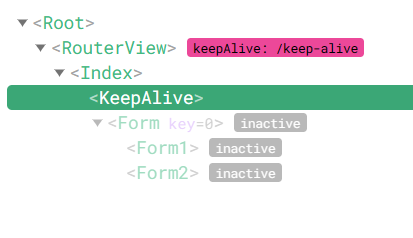

# 组件缓存

> [参考](https://cn.vuejs.org/api/built-in-components.html#keepalive)

在使用动态组件，v-if或vur-router的时候，切换组件时组件会被卸载，再次激活时又会重新挂载。
这样来回初始化可能会照成系统卡顿，可以用`<keep-alive>`标签来缓存组件。

这样组件会被缓存而不是直接卸载，再次激活时不会初始化。通过调试工具可以看到被缓存的组件显示非活跃状态，
如果是被卸载的，就不会出现在DOM树上。



## 使用

用`<keep-alive>`包裹一个动态组件就能缓存，注意：`keep-alive`只能有一个直接子组件，有多个直接子组件会报错

```vue
<script setup lang="ts">
import { ref } from 'vue'
import MyForm from './form.vue'

const state = ref(true)
</script>

<template>
  <div>
    <button @click="state = !state">切换</button>

<!--   keep-alive下只能存在一个直接子组件，这样他才能正确缓存 -->
    <keep-alive>
      <component :is="state? MyForm: null" />
    </keep-alive>
  </div>
</template>
```

## v-if

如果使用`v-if`加`<template>`来包裹多个组件会缓存失败，因为`keep-alive`只能有一个**直接子组件**

```vue
<script setup lang="ts">
import { ref } from 'vue'
import Form1 from './form1.vue'
import Form2 from './form2.vue'

const state = ref(true)
</script>

<template>
  <div>
    <button @click="state = !state">切换</button>

<!--   这样做无法缓存组件 -->
<!--   官网有说明：任何时候都只能有一个活跃组件实例作为 <KeepAlive> 的直接子节点。 -->
<!--   https://cn.vuejs.org/api/built-in-components.html#keepalive -->
    <keep-alive>
      <template v-if="state">
        <form1 />
        <form2 />
      </template>

      <div v-else>
        默认内容
      </div>
    </keep-alive>
  </div>
</template>
```

要缓存多个组件，应该把这些组件放到同一个组件下，下面这个示例就是把要缓存的两个表单都放到同一个组件下，这样就能缓存了

```vue
<template>
    <keep-alive>
<!--     要缓存的多个组件都放到my-form下 -->
      <my-form v-if="state" />

      <div v-else>
        默认内容
      </div>
    </keep-alive>
</template>
```

## vue-router

```vue
<template>
  <router-view v-slot="{ Component }">
    <transition>
      <keep-alive>
        <component :is="Component" />
      </keep-alive>
    </transition>
  </router-view>
</template>
```

## 生命周期钩子

被缓存的组件在激活和失活时会触发`onActivated`和`onDeactivated`，父组件被缓存，子组件的这个钩子也会触发

```vue
<template>
    <keep-alive>
<!--     my-form下面的组件也会触发激活和失活钩子 -->
      <my-form v-if="state" />

      <div v-else>
        默认内容
      </div>
    </keep-alive>
</template>
```

因为父组件被缓存了，所以它的子组件自然也不会被销毁，切换状态时子组件也是被缓存的

这两个钩子只会在激活的时候触发一次，所以可以在激活的时候进行一些初始化，比如获取发请求获取数据之类。


## watch

组件失活时不会触发响应式，watch之类的监听器也不会触发

```vue
<script setup lang="ts">
import { watchEffect } from 'vue'

const props = defineProps<{
  count: number
}>()
// 这个监听只有在组件激活时才会触发
watchEffect(() => console.log('form监听', props.count))
</script>

<template>
  <div>
    子组件 {{ count }}
  </div>
</template>
```