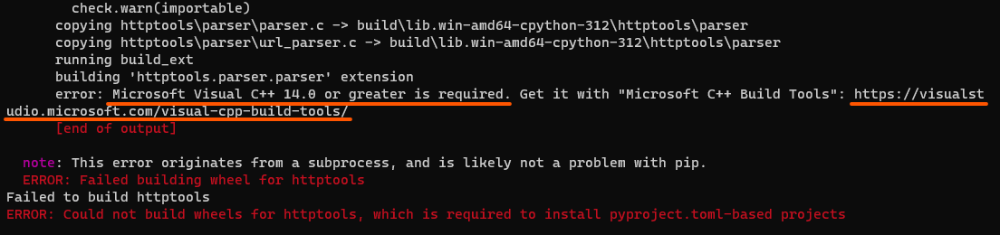
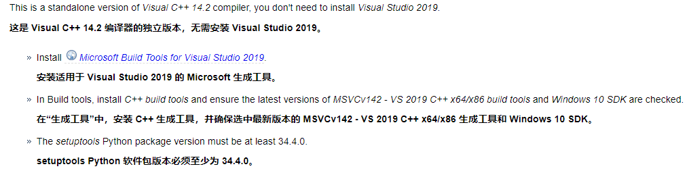
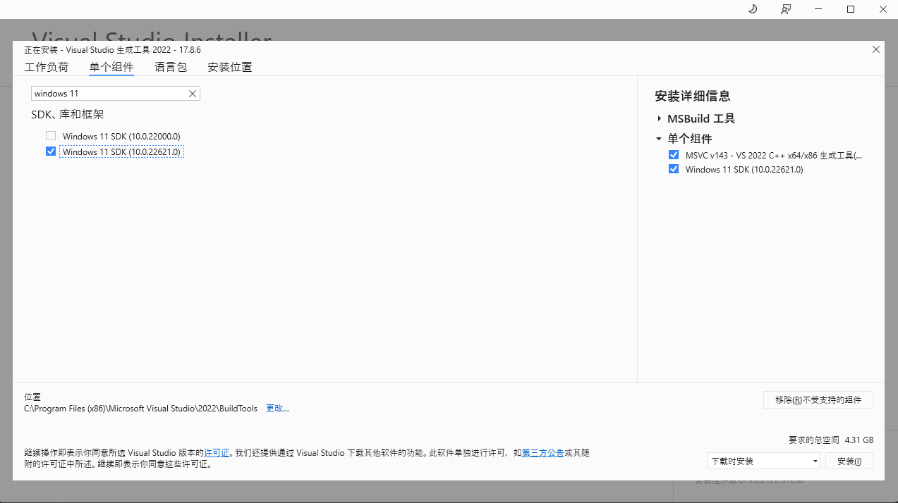

# error: Microsoft Visual C++ 14.0 or greater is required.

## 报错原因

安装某些包的时候需要用C++来编译（比如httptools），电脑缺少C++编译器就会报这个错

[//]: # (![C++ is required]&#40;../../../static-img/backend/python/FAQ/C++isRequired.png&#41;)

## 解决办法

这里只需要安装C++编译器就可以了，点击它给的[地址](https://visualstudio.microsoft.com/visual-cpp-build-tools/)，跳转过去下载生成工具。

跳转到[这里](https://wiki.python.org/moin/WindowsCompilers)下载对应python版本的编译器。下载生成工具的时候不要下载IDE，这样安装体积会很大。
按照对应python版本给的提示，只需要安装对应的工具就行了

