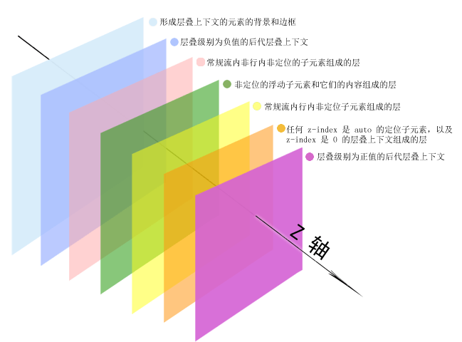
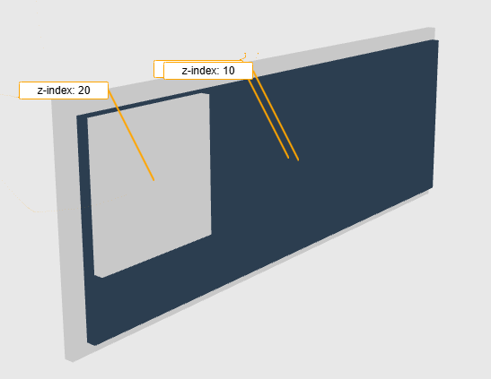

# 层叠上下文

网页的布局是由多个图层组成的，层层叠加起来形成我们看到的网页，我们不仅可以调整X、Y轴的位置，还可以调整Z轴位置。

Z轴看起来像这样，Z轴越大的离屏幕越近同时也会遮住其他图层。

edge浏览器的3D视图工具也可以看到各个元素的排列位置

## 图层

所有元素默认会在一个图层上渲染，如果想要实现背景是一个``，上面有一些文字，这种情况就可以给img或文字创建单独的图层，
通过调整`z-index`的值，让文字图层覆盖在img上。

  
A
  

  
B
  

上面的案例就是创建了两个图层实现的

层叠上下文还有一个好处，就是调整元素大小的时候，他不会挤压到其他图层的元素，只会影响同一图层的元素。如果所有元素都在同一图层，
就没法实现复杂的视差滚动效果了。

<ElHover />

现在两个div在同一图层，后写的元素会覆盖前面的元素，这里元素B就盖在A上面，hoverA的时候他被放大了，就会盖在B上面。切换不同图层鼠标hover观察效果。

## 创建图层

下面这些属性可以创建图层

- position 值为 absolute 或 relative 且 z-index 值不为 auto 的元素；
- position 值为 fixed 或 sticky 的元素
- flex 容器的子元素，且 z-index 值不为 auto；
- grid 容器的子元素，且 z-index 值不为 auto；
- opacity 属性值小于 1 的元素
- transform 属性不为none
- will-change 值设定了任一属性而该属性在 

一般会用`position: absolute;`比较多

## 优先级

创建了不同图层之后，可以通过`z-index`属性调整图层的显示位置以覆盖其他元素。值越大越靠前
