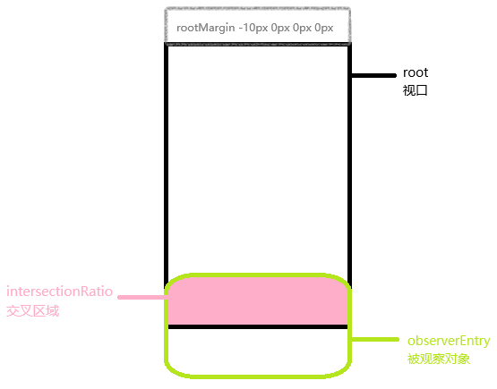

# 视口监听

> 参考：[1](https://developer.mozilla.org/zh-CN/docs/Web/API/IntersectionObserver) [2](https://developer.mozilla.org/zh-CN/docs/Web/API/Intersection_Observer_API)

观察一个元素是否出现在视口内，元素移动时也可以观察到，相当于`addEventListener()`监听滚动事件，可以用来做图片异步加载



## IntersectionObserver

这个类用来创建观察对象，当触发观察时，执行参数里面的回调

**用法**

```js
const observer = new IntersectionObserver((entries: IntersectionObserverEntry[]) => {
    // 观察的对象出现在视口时执行这里的代码
})
// 开始监听#test这个元素
observer.observe('#test')
```

**参数**

第一个参数是需要执行的回调函数

第二个参数是一个对象，可以填下面这些参数

**root**

指定一个元素作为视口元素，不传的话默认会以页面`document`对象作为视口，如果传递的话这个元素一定要是被观察元素的父元素，否则观察不会生效。
要观察`#test`这个元素，这里的root必须指定为`#test`的父元素

**rootMargin**

一个字符串，用来指定视口的边界，相当于给视口指定margin值。默认值是`0px 0px 0px 0px`，注意单位必须是%或px，不能指定纯数字。

如果传递这个值的话视口的边界会发生变化，比如`100px 0px 0px 0px`视口的顶部会向上延伸100px，相当于视口高度增加了100px，这时候被观察的元素距离视口还有100px的时候就会被观察到，
即使你在页面上还没看到它。如果指定负值`-100px 0px 0px 0px`视口顶部会回退100px，相当于视口高度减少了100px，被观察元素出现在页面上，但是距离视口还有100px的时候也不会触发回调。

**thresholds**

一个列表，里面的元素可以是0.0~1.0之间的数，表示要触发回调的时机，当元素出现在视口的面积达到多少要触发回调，元素在出现在视口区域的占比可以通过`intersectionRatio`查看。

如果值是`[0, 1]`的话，也就是元素第一次出现在视口时，触发阈值0，全部出现在视口时触发阈值1。

如果是`[0.01, 0.02, 0.03 ... 1]`，就表示元素在视口内每移动1%就触发回调。可以用这个方法生成这个列表。

一个div高100，当10px的高度出现在视口时，这时候intersectionRatio=10/100=0.1，就会触发0.1的阈值。当整个100px的高度出现在视口时
intersectionRatio=100/100=1，触发1的阈值。

```js
const generatePrecisionArray = () => {
  return Array.from({ length: 100 }, (_, i) => (i + 1) / 100)
}
```

需要注意，如果元素全部出现在视口内，并且上下还有很多余量的话，这时候移动元素不会触发观察，因为元素已经全部在视口范围内，intersectionRatio始终等于1。

## observer实例

调用`new IntersectionObserver()`时返回一个对象，调用这个对象的方法可以观察或取消观察元素

```js
const observer = new IntersectionObserver()
```

**方法**

**observe**

传入一个元素，开始观察这个元素。

```js
observe.observe(box)
```

**disconnect**


<p style="color: darkred; font-size: 20px;">未完成，这个API太简陋无法实现复杂功能，建议用GSAP代替</p>

[GSAP](https://gsap.com/)