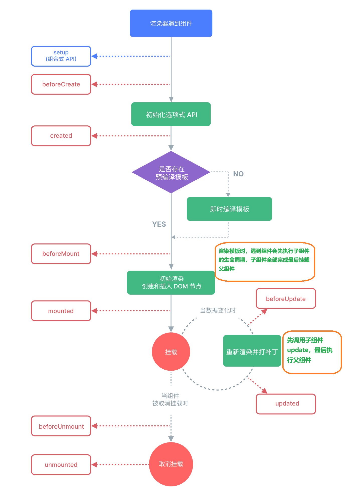

# 生命周期

这里对[官网文档](https://cn.vuejs.org/guide/essentials/lifecycle.html)的生命周期做一个补充



## 循环挂载

组件的`onMounted`是递归调用的，当前组件运行完`onBeforeUpdate`开始渲染模板，模板中遇到一个组件时会先挂载子组件，子组件加载完成才调用父组件的`onMounted`。

可以把生命周期当成一个递归函数，每当渲染到组件，就把当前组件丢给生命周期处理，只有当上一个周期完成，才能返回到当前周期中。

```vue
// A.vue
<script setup lang="ts">
import { ref } from 'vue'
import A1 from './a1.vue'

const count = ref(0)
</script>

<template>
  <div>
    子组件
    <A1 v-model="count" />
  </div>
</template>
```

对于上面这个组件，执行顺序就是

```js
/*
|- A onBeforeMount 父组件挂载前
|- | a1 onBeforeMount
|- | a1 onMounted
|- A onMounted 父组件挂载完成
|- | a1 onActivated
|- A onActivated 父组件激活
*/
```

## onUpdated

如果子组件更新了父组件的ref值，会先执行子组件`onUpdated`再执行父组件

```vue
<template>
  <div>
    子组件
    <A1 v-model="count" />
  </div>
</template>
```

子组件修改传递过来的count值，时上面这个组件的执行顺序就是

```js
/*
|- onBeforeUpdate 父组件更新前
|- | onBeforeUpdate
|- | onUpdated 子组件更新完成
|- onUpdated 父组件更新完成
*/
```

## onActivated

`onActivated`在所有组件挂载完成后执行，包括所有子组件，参考上面循环挂载的示例。

需要注意，`onActivated`必须在`keep-alive`组件内部才能执行，并且他的所有子组件都会执行`onActivated`

```vue
<template>
  <keep-alive>
    <component :is="comp" />
  </keep-alive>
</template>
```

**特别需要注意**，`onActivated`在组件挂载完之后执行，所以如果用的是异步组件，他的子组件在首次挂载的时候就没法触发`onActivated`

```vue
// demo.vue
<script setup lang="ts">
import A from './a.vue'

const B = defineAsyncComponent(() => import('./b.vue'))
</script>

<template>
  <keep-alive>
    <component :is="comp" />
  </keep-alive>
</template>
```

上面这个组件，A组件是正常导入的，在demo.vue首次挂载会同步挂载A，不需要异步的等待A组件，所以A组件和A下面的子组件都能同步的调用所有生命周期。

如果是B组件，demo.vue挂载的时候需要等待B组件挂载，可能是因为异步组件，vue只把B组件本身加入了`keep-alive`的缓存树，因为他是`keep-alive`的直接子组件，
对于B的子组件，就不能同步的加入到缓存树中，导致后面B组件全部挂载完成，缓存树中只有B组件，没有他的子组件，所以子组件在第一次挂载的时候就不会触发`onActivated`

对于这种异步的组件，可以在`onMounted`和`onActivated`中都写上初始化方法
